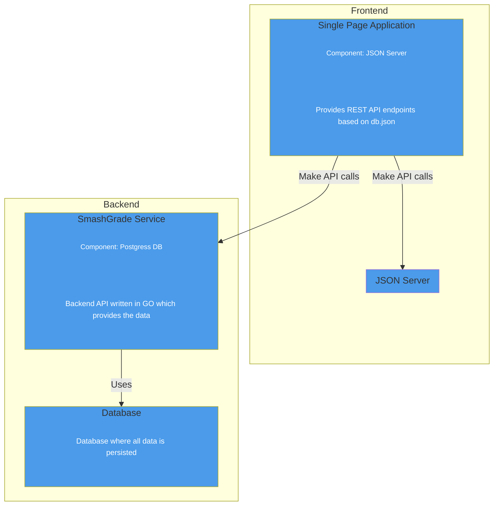

# Overview of the Architecture
The architecture is composed of a backend and frontend.

```mermaid
flowchart TB

subgraph frontend[Frontend]

    subgraph singlePageApplication[Single Page Application]
        direction LR
        h3[Component: React.JS App]:::type
        d3[User Interface for the SmashGrade App]:::description
    end
    singlePageApplication:::internalComponent


    subgraph jsonServer[JSON Server]
        direction LR
        h3[Component: JSON Server]:::type
        d3[Provides REST API endpoints based on db.json]:::description
    end
     jsonServer:::internalComponent


end

singlePageApplication--Make API calls-->smashgradeservice
singlePageApplication--Make API calls-->jsonServer


subgraph backend[Backend]
    subgraph smashgradeservice[SmashGrade Service]
        direction LR
        h10[Component: SmashGrade Service]:::type
        d10[Backend API written in GO which provides the data]:::description
    end
    smashgradeservice:::internalComponent

    subgraph database[Database]
        direction LR
        h10[Component: Postgress DB]:::type
        d20[Database where all data is persisted]:::description
    end
    database:::internalComponent

    smashgradeservice--Uses-->database

end


%% Element type definitions


classDef person fill:#08427b
classDef internalContainer fill:#1168bd
classDef internalComponent fill:#4b9bea
classDef externalSystem fill:#999999 


classDef type stroke-width:0px, color:#fff, fill:transparent, font-size:12px
classDef description stroke-width:0px, color:#fff, fill:transparent, font-size:13px
```
## Frontend
The Frontend is a React.JS App.

## Backend
The backend is written in GO