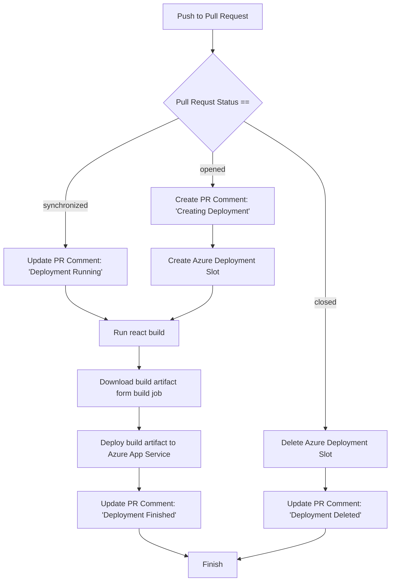

# Frontend
The Frontend React App is automatically deployed using GitHub Action Workflows.

## Workflow Flow Chart

```mermaid
flowchart TD
  Push[Push to Pull Request] --> CheckPullRequestStatus{Pull Requst Status == };
  CheckPullRequestStatus -->|opened| CreateComment;
  CheckPullRequestStatus -->|synchronized| UpdateCommentRunning;
  CheckPullRequestStatus -->|closed| DeleteAzureSLot;

  UpdateCommentRunning[Update PR Comment: 'Deployment Running'] --> RunBuild
  CreateComment[Create PR Comment: 'Creating Deployment'] --> CreateAzureSlot
  RunBuild[Run react build] --> DownloadBuildArtifact
  CreateAzureSlot[Create Azure Deployment Slot] --> RunBuild;
  DeleteAzureSLot[Delete Azure Deployment Slot] --> UpdateCommentDeleted;
  DownloadBuildArtifact[Download build artifact form build job] --> DeployToAzureAppService
  DeployToAzureAppService[Deploy build artifact to Azure App Service] --> UpdateCommentDone
  UpdateCommentDone[Update PR Comment: 'Deployment Finished'] --> Finish;
  UpdateCommentDeleted[Update PR Comment: 'Deployment Deleted'] --> Finish;
  Finish[Finish]

```
## Example workflow run in GitHub
Opened Workflow:

Closed Workflow:

